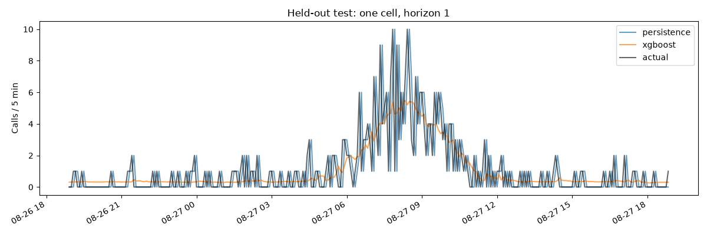
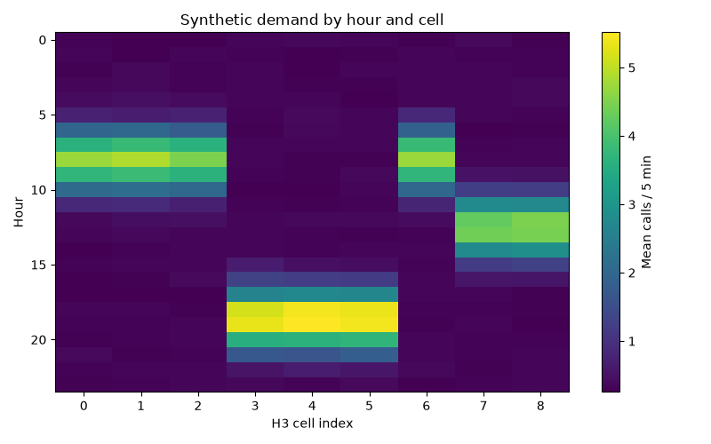
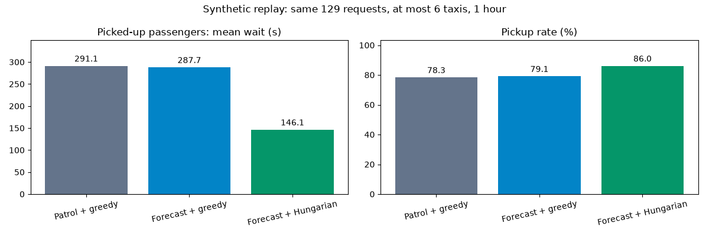

# Unity 연동 전 Python 로직 수정·검증 보고서

2026-09-10 검증. 대상은 `20260910ver`이며 이전 버전 폴더와 기존 모델 파일은 수정하지 않았다. Unity 3D·통신 구현은 다음 단계이다.

## 구현 결과

- 5분 시간×H3 격자를 완성하고 0수요 구간을 보존했다. 지역별 lag·이동평균·달력·셀 중심 좌표를 피처로 사용한다.
- 외부 관측은 시간/H3 키로 결합하며 과거 값만 전달한다. 최초 미관측은 0과 missing 표시로 구분한다. 학습 자료의 외부 관측은 명시적인 합성 데이터다.
- 완료된 구간 t를 기준으로 t+1…t+6 수요를 예측한다. train/validation/test는 모든 지역에 공통 시간 경계를 사용하며 타깃이 경계를 넘는 30분 구간은 제외한다.
- XGBoost는 4개 파라미터 후보를 검증 구간에서 비교하고 테스트는 선택에 사용하지 않는다. CNN-LSTM은 실제 12개 연속 관측 입력·6개 출력·학습 자료 정규화·검증 loss에 따른 epoch 선택을 사용한다.
- 재배치 결정은 실제 빈 택시 수와 예측 수요를 사용한다. 수요/최소 1대 공급 비율로 제한된 할증 배수를 계산하고, `예측 수요 × 할증 배수`를 목표 분포 가중치로 사용한다. 정수 배분 합은 가용 fleet 예산을 넘지 않는다.
- 재배치는 5분마다 설정 비율 이하의 빈 택시만 이동시킨다. 기존 픽업·탑승 경로는 보존하고 헝가리안 현재 호출 매칭은 SUMO 도로 이동시간으로 계산한다.
- GUI/headless가 같은 루프를 사용한다. 배차 알고리즘 비교 주기는 모두 1초다. 빈 호출 구간에서도 설정 종료까지 실행한다.
- A/B는 같은 도로·초기 차량·고정 호출을 사용하며 호출 fingerprint를 검증한다. 삽입 대기 차량을 중복 보충하던 문제도 수정했다.
- 성공자 평균과 별도로 탑승률·타임아웃·종료 미탑승·삽입 실패·텔레포트·샘플링 fleet 대수를 저장한다. 사용자 설정 파일을 비교 실행 중 변경하지 않는다.

## 검증 조건

`presets/python_validation.json`: 합성 3×3 블록, 일반 차량 4종 각 5대, 택시 6대, 표시용 자율주행 타입 1대, 장애물 0개. 날짜 2026-08-31 17:00~18:00, 시드 42, 9개 H3 셀, 호출 강도 1.5. 학습은 직전 21일의 합성 호출 54,721건이다. 이 구성은 알고리즘 검증용이며 Unity 최소 객체 구성 제출 시나리오는 아니다.

검증 환경: Python 3.12, SUMO/TraCI 1.27.1, pandas 3.0.5, XGBoost 3.4.1, PyTorch 2.14.0. CNN은 검증 프리셋의 2 epochs를 실행했다. macOS에서 두 OpenMP 런타임의 동기화 정지가 관측되어 CNN CPU 연산은 단일 스레드로 실행한다.

## 예측 평가

| 모델 | RMSE | MAE | MAPE(양수 타깃) | WAPE |
|---|---:|---:|---:|---:|
| XGBoost | 1.1155 | 0.7360 | 60.97% | 73.16% |
| 직전 관측 유지 | 1.5283 | 0.8680 | 78.19% | 86.29% |
| CNN-LSTM (2 epochs) | 1.1333 | 0.7123 | 65.04% | 71.37% |

XGBoost/직전 관측 유지 평가는 65,232개 스칼라 타깃 중 37,506개가 0수요다. CNN은 분할 내 12구간 시퀀스가 완성된 표본만 평가해 64,638개 타깃을 사용하므로 위 표를 완전히 동일한 표본의 모델 순위로 해석하지 않는다. 온라인 배차는 XGBoost를 사용한다.

## 수정 후 실제 SUMO 결과

다음 결과만 최종 코드의 성능 기록으로 사용한다. 초기 검사에서 택시 중복 보충 문제를 발견하기 전에 얻은 짧은 대기시간 수치는 폐기했다.

| 전략 / 매칭 | 호출 | 탑승 | 평균 대기(탑승자) | 타임아웃 | 종료 미탑승 대기 | 재배치 | 텔레포트 |
|---|---:|---:|---:|---:|---:|---:|---:|
| Patrol + greedy | 129 | 101 | 291.07초 | 10 | 18 | 0 | 0 |
| Forecast + greedy | 129 | 102 | 287.70초 | 8 | 19 | 3 | 3 |
| Forecast + Hungarian | 129 | 111 | 146.11초 | 10 | 8 | 2 | 0 |

세 조건 모두 3,600초를 완료했고 호출 SHA-256이 일치했다. 삽입 실패는 0건, 샘플링 최대 fleet은 6대였다. 첫 시점에 일부 택시는 도로 삽입을 기다리므로 실제 도로 위 fleet은 6대보다 작을 수 있다.

예측+greedy 실행에서 SUMO의 `beyond end of lane` 텔레포트 3건이 발생했다. 경고를 켠 별도 재실행에서도 동일하게 관측됐다. 외부 이동 보정이 포함된 조건이므로 이 결과로 순수한 재배치 개선 효과를 확정하지 않는다. 헝가리안 결과도 단일 합성 날짜·지도·시드에 대한 결과이며 실제 서비스 개선율을 뜻하지 않는다.

## 검사 상태

- `tests_logic.py`: 0수요 격자, 외부 관측의 과거 방향 결합, 지역별 이동평균, 6개 미래 타깃, 시간 분할, 실제 시퀀스, 0수요 MAPE, 일별 호출 재현성, 할증/예산 상한, 픽업 보호, 삽입 대기 중복 방지, 빈 구간 종료 방지, 미래 호출·날씨 미참조 검사 통과.
- `tests_logic.py --sumo`: 실제 순찰 반복 결과 일치, greedy/헝가리안 실행 완료, 동일 호출 fingerprint, 승객 수 보존, fleet 상한 검사 통과.
- XGBoost 학습/튜닝/평가/저장 및 CNN-LSTM 2 epochs 학습/평가/저장 완료.
- 노트북 두 개의 코드 셀을 Python에서 실행해 생성 결과를 읽는지 확인했다. 노트북에는 커널 실행 출력이 저장돼 있지 않다.
- 최종 환경 생성 결과의 도로/H3 매핑·초기 차량 경로가 검증에 사용한 맵과 일치했다. 일반 차량 4종 각 5대·정지 장애물 2개 생성과 SUMO 60초 XML 로딩도 통과했다.
- Python 문법 검사 및 Git 공백 오류 검사 통과. Unity 및 SUMO GUI 시각 동작은 검사하지 않았다.

## 남은 범위와 해석 제한

- Unity 제공 3D Asset·좌표 연동·객체 이동/상태 표현은 아직 구현하지 않았다.
- 외부 API의 과거 호출·날씨·교통량 수집은 구현하지 않았다. 실제 자료 사용 시 데이터 로더와 시간/H3 매핑을 연결해야 한다. 현재 합성 자료 생성기는 과제에서 허용한 가상 데이터 방식이다.
- 실시간 OSM 다운로드와 현재 기본 강남역 맵의 장시간 주행은 이번 검증 범위가 아니다. 검증된 범위는 함께 저장한 합성 격자 프리셋이다.
- 셀별 공급은 도로 대표 H3에 기반한 근사이며 30분 내 택시의 재서비스 회전율·실제 기사 수락 행동·지급 정산을 모델링하지 않는다. 할증은 시뮬레이션의 배치 가중치다.
- 지역 대표 도로 한 곳을 목표로 이동하며, 대규모 fleet의 전체 쌍 경로 조회는 후보 영역 제한이 필요할 수 있다.
- 여러 날짜·시드·수요 강도로 반복 비교하고 텔레포트 조건을 별도 분석한 뒤 성능 우위를 주장해야 한다.

재현 명령은 [README](README.md), 작은 결과 원본은 [docs/validation](docs/validation), 전체 실행 출력은 로컬 `results/`에 있다.
