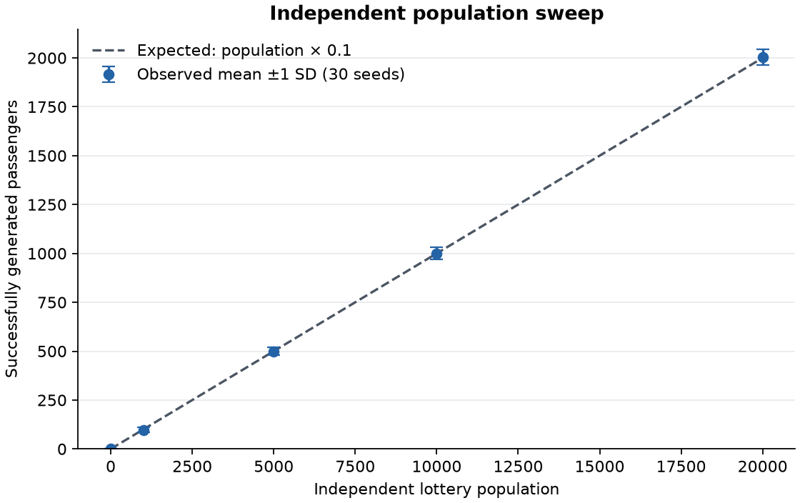
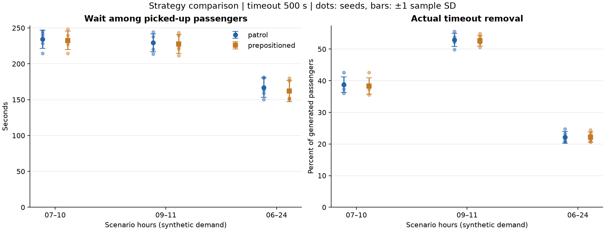
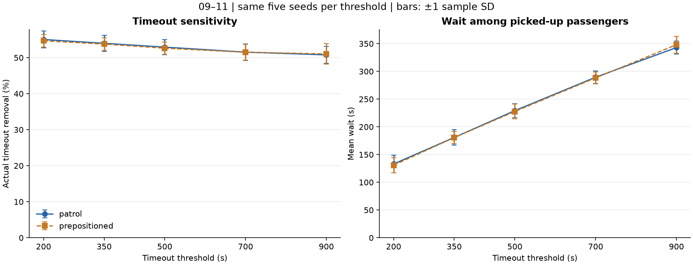
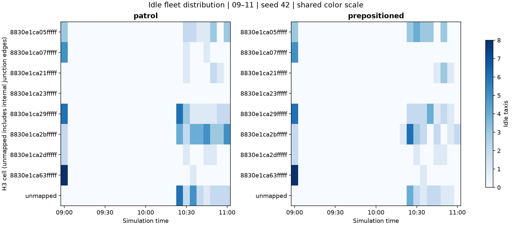

# 통합 분석 보고서

이 문서는 SUMO 런타임, 시공간 전처리, 30분 수요 예측, 동적 배차·인센티브, Unity replay 연결을 하나의 재현 경로로 설명한다. 데이터는 명시적으로 합성 호출·외부 관측이며 실제 카카오 호출·실시간 교통 효과로 일반화하지 않는다.

## 1. 런타임 검증 — SUMO 실행과 측정 (담당 송신화)

이 문서는 **2번 담당 SUMO 런타임**의 구현과 측정 결과를 다룬다. **계획한 실제 SUMO 실험 70/70회가 완료되었고, 70개 원시 승객 기록 대조·48개 인구 통계 검사·GUI/headless 일치 검사를 모두 통과했다.** 프로젝트 전체 모델 정확도·EDA·3D Asset 연동을 완료했다는 보고서가 아니다.

- [런타임 구현·실험 설계·실행 가이드](docs/runtime_validation.md)
- [실제 전략 비교 및 타임아웃 민감도 결과](results/runtime_validation/RESULTS.md)
- [인구 스윕 원시 집계](results/runtime_validation/population_sweep.csv)
- [시간대별 스케줄 검사](results/runtime_validation/schedule_sweep.csv)

최소 구성은 3×3 블록, 승객 5명, 택시 3대, 일반 차량 4종 각 5대, 자율주행 표시 차량 1대, 장애물 2개다. headless·GUI 모두 5명이 탑승했고 평균 대기시간은 49.2초, 실제 타임아웃은 0명이었다.

실험 중 발견한 택시 무제한 보충 문제를 수정했다. 진입 대기 차량을 제외하던 이전 로직은 50대 설정에서 도로 관측 88대까지 증가시켰으므로 당시 결과는 비교 통계에서 제외했다. 수정 후 매 스텝 loaded 택시 수 상한을 검사한다.

### 인구 생성 검증

독립 인구·학교·회사 모수 및 회사 edge 수를 한 변수씩 변경하여 30개 시드로 검사했다. 학교는 전체 모수, 회사는 edge당 모수다. 학교·회사 추첨은 독립 인구 변경과 무관하게 동일하게 유지된다.

### 전략과 타임아웃 비교

`patrol`과 `prepositioned`의 비교다. 후자는 시간표 기반 구역 선호 전략이며 AI 예측 기반 배차와 구분한다. 그래프의 오차 막대는 시드 간 표본 표준편차다.

타임아웃 500초, 동일한 5개 시드의 산술평균이다.

| 실행 구간 | patrol 대기(s) | prepositioned 대기(s) | patrol 타임아웃률 | prepositioned 타임아웃률 |
|---|---:|---:|---:|---:|
| 07~10시 | 234.06 | 232.65 | 38.76% | 38.36% |
| 09~11시 | 229.21 | 227.68 | 52.92% | 52.63% |
| 06~24시 | 166.96 | 161.99 | 22.13% | 22.20% |

오전 두 구간의 대기시간 차이는 약 1.4~1.5초로 작다. 하루 전체 평균은 약 4.97초 줄었지만 타임아웃률은 0.07%p 늘었다. 18~24시 호출 코호트의 평균 대기는 124.88→120.77초, 타임아웃률은 9.40→9.62%였다. 이 조건에서 시간표 전략이 모든 지표를 개선한다고 결론 내릴 수 없다.

09~11시 patrol 기준 5개 시드 평균:

| 임계값(s) | 평균 대기(s) | 타임아웃률 | 500초 대비 타임아웃 변화(%p) |
|---|---:|---:|---:|
| 200 | 133.06 | 55.05% | +2.12 |
| 350 | 180.92 | 53.99% | +1.07 |
| 500 | 229.21 | 52.92% | 0.00 |
| 700 | 289.53 | 51.54% | -1.38 |
| 900 | 342.94 | 50.77% | -2.16 |

500→900초로 늘리면 타임아웃률이 약 2.16%p 줄지만 탑승자 평균 대기는 약 113.73초 늘어난다. 비용·서비스 목표가 정해지지 않았으므로 최적 임계값을 단정하지 않는다.

탑승자 평균 대기시간만으로 전략을 평가하지 않는다. 타임아웃·종료 미탑승·예약 보류, 생성 수, 텔레포트도 함께 확인한다. 기본 타임아웃 500초는 자동 변경하지 않았다.

06~24시 실행에서 18~24시 호출의 결과를 별도 집계한다. 합성 날짜 2026-09-18에는 요일별 급증 효과를 추가하지 않았으며 실측 금요일 상황을 검증한 결과가 아니다. 후속 수요는 실제 흡수량에 의존하므로 전략마다 달라질 수 있다.

예측 모델 선정·성능 평가, 전체 EDA, 제공 3D Asset 적용은 타 담당 결과를 연결해야 한다. 런타임의 합성 수요 결과를 실제 서비스의 인과적 개선 효과로 일반화하지 않는다.

### 최종 검증

- 런타임 회귀 테스트 25개 통과
- 인구 통계 검사 48개 통과(설정별 30시드), 실제 격자망·반복 재현 검사 4개 통과
- 강남역 실험 70회 모두 정상 종료, 생성 실패·기타 소실·보유 택시 상한 위반 0건
- 모든 실행이 동일 코드 버전·지도 해시 사용, 70개 원시 기록과 요약 일치
- 원본 `config.json` 유지, 공용 학습 CSV에 실험 로그 추가 없음

검증 근거: [acceptance.json](results/runtime_validation/acceptance.json), [테스트 결과](results/runtime_validation/test_results.json), [통합 검사](results/runtime_validation/integration_checks.json). SUMO 텔레포트는 실행별 1~641회, 종료 시 장기 대기 예약 보류는 0~31명이었다. 이 조건을 실제 서비스의 개선 효과로 일반화하지 않는다.

## 2. 시공간 데이터 특성 분석 (EDA) 및 전처리 — Module 2 (담당 윤세빈)

> 그림·수치는 `notebooks/03_EDA_8weeks.ipynb`(실행 결과 포함)와 `data/eda/8w/`, ablation은 `data/eda/feature_ablation_8w_synthetic.md`.
> 재실행: `python eda/eda_8w.py` (8주 calls.csv·external.csv를 `data/generated_8w/`(저장소 밖 보관)에 두거나 `python scripts/generate_training_data.py --days 56`으로 재생성), `python scripts/feature_ablation.py data/generated/calls.csv --external data/generated/external.csv`.
> 1일치 예비 분석(2026-09-10)은 `notebooks/01_EDA_and_Spatial.ipynb`에 남겨 두었고, 아래는 8주 데이터로 확정한 결과다.

### 2.1 데이터
- 강남역 SUMO 디지털 트윈 합성 호출 8주(2026-07-06 월 ~ 08-30 일), **36,786건**, 날짜별 고정 시드 42 → 완전 재현. 실제 카카오 데이터 아님(과제 제약 #7 허용).
- 관측 단위 H3 res 8 셀 8개 × 5분칸 16,125개 = **129,000행**. 수요 0인 칸 80.1%, 칸당 평균 0.285건, 최대 11건 — 희소 카운트 데이터.
- 일별 호출 평균 657건(최소 487, 최대 953). 요일별 하루 평균: 월 646, 화 662, 수 672, 목 666, **금 899**, 토 527, 일 527.

### 2.2 시간 패턴 (`02_hour_dow_heatmap.png`, `04_weekday_holiday.png`)
- 피크 8시(등교·출근)와 18~19시(퇴근·저녁). **금요일 18~20시**가 가장 진한 칸 — "강남역 금요일 저녁" 시나리오가 데이터에 재현됨(이벤트 셀 ×3).
- 금요일은 다른 평일보다 +35%, 주말은 평일 대비 −26%(아침 피크 소멸, 저녁만 남음).
- 기간 내 평일 공휴일 없음(8/15가 토요일) → `is_public_holiday`·연휴 피처는 이 데이터에서 주말과 구분되지 않음. 생성기가 대체공휴일(8/17)을 달력으로 넣어야 분리 가능.

### 2.3 공간 격자 — H3 resolution 8 (팀 기준) (`03_cell_profiles.png`)
- 셀 8개의 총량은 11.7~13.8%로 고르지만 **피크 시각이 셀마다 다르다**: 4개 셀 8시, 3개 셀 18~19시, 1개 셀 12시(음식점). 격자별로 따로 학습해야 하는 이유이고, 모든 시계열 피처를 셀별 groupby 안에서 계산하는 이유.
- 해상도 판단(1일치 EDA, `data/eda/h3_resolution_compare.png`): res 8은 셀 7개에 최다 셀 35%(too coarse), res 10은 0인 칸 37%·lag-1 r 0.17(too fine), **res 9가 EDA상 적정**. 그러나 시뮬레이션 도로–격자 매핑과 저장 모델의 셀 목록이 같은 해상도여야 해서 develop 통합 시 **팀 기준 res 8로 통일**했다(`config.json h3_resolution`). 해상도 변경 시 모델 재학습 필요.
- 대용량 처리: 좌표 고유값 캐시 + chunk. 10만 행(중복 없는 최악 조건) H3+Geohash 변환 0.42초, 행 단위 apply 대비 2.3배.

### 2.4 POI zone 검증
- `eda/poi_zone_map.py`: 학교 5·주택 42·회사 66·음식점 218 구역을 지도에 겹쳐 확인(`data/eda/poi_zone_map.png`). 매핑 반경은 결과에 영향 없음(40~200m 동일). 주택 POI가 큰길로 매핑되는 문제 → Module 1 공유.

### 2.5 정상성·자기상관 (`08_stationarity.png`, `09_acf.png`)
**정상성(ADF, 전체 셀 합 5분 계열)**: 원계열 통계량 −18.6, 1차 차분 −24.9 (1% 임계값 −3.43) → 둘 다 단위근 없음.
1일치(09~11시)에서 원계열이 비정상(p=0.73)이었던 것은 2시간 창 안의 출근 상승 추세 때문이고, 8주 전체로는 수요가 일 주기 주변에서 정상적으로 흔들린다. 의미: 차분이 필수는 아니지만 일·주 주기가 강하므로 계절 피처(`same_time_yesterday`, `same_time_last_week`)와 단기 추세(`diff_1`)를 함께 쓴다. ARIMA 계열과 비교한다면 d=0 + 계절 항(SARIMA).

**자기상관(ACF, 셀 평균)**: lag1 0.38, lag6(30분) 0.36, lag12(1시간) 0.31, 유의 lag **40개**(±0.015). 계절 lag 1일 전 0.31, 1주 전 0.34.
1일치의 "판정 불가"가 8주에서는 "40칸까지 유의"로 확정 — lag 6개 + rolling 1h(12칸)는 유의 구간 안이고 그 이상은 rolling·계절 피처가 대신한다.

### 2.6 외부 데이터(날씨·달력) 병합과 품질 기준
- 날씨 결합: 관측 표(시간별 또는 5분) → 5분 칸에 `merge_asof(backward, tolerance 3h)` — 그 시각 이전 최신 관측만 사용(누수 없음). ≤3h 공백 선형보간 + `weather_interpolated`, 그 밖 `weather_missing` 플래그(원천이 제공하는 변수만 판정), 파일 없으면 상수 fallback + 경고.
- 품질 기준(Data Spec 5장, 위반 시 ValueError로 중단): 기온 −40~50℃·강수 0~200mm·풍속 0~75m/s, 관측 간격 경계 정렬, 학습 경로 결측률 ≤ 5%(`weather_missing_max_ratio`), 공휴일 달력이 데이터 연도를 덮을 것, (time_bucket, h3_index) 유일, demand ≥ 0, 5분 경계 정렬, tz 단일.
- 파생 피처: 날씨 `precip_3h_sum`·`rain_streak_h`·`temp_anomaly_24h`(과거 방향), 달력 `is_public_holiday`·`is_day_before_off`·`is_day_after_off`·`off_streak_len`, 수요 `same_time_yesterday`. 모델 입력 피처 34 → **43개**. 검증: `tests/test_module2.py` 85개(실제 `holidays` 달력·대체공휴일 포함 검사).

### 2.7 날씨·휴일이 수요에 미치는 영향 (`05_weather_rain.png`, `06_weather_temp.png`, `07_rain_day.png`)
같은 셀·같은 시간대 평균을 1로 둔 호출 비율:

| 강수 | 0 mm | 1.2 mm | 5.5 mm |
|---|---:|---:|---:|
| 호출 비율 | 0.92 | 0.98 | **1.27** |

- 비가 많이 올수록 호출이 는다(생성기 배수 1+0.08×mm와 일치). 기온은 구간별 0.96~1.04로 효과 없음(생성기가 기온을 수요에 넣지 않음).
- **한계**: 합성 강수의 자기상관이 5분 0.002, 1시간 −0.003(실측 강남역 1시간 0.77). 지금 비가 오는지가 5분 뒤 비와 무관해, 과거만 쓰는 모델은 미래 강수 효과를 학습할 수 없다. 이것이 2.8의 날씨 피처 기여 0의 원인이며 피처 설계가 아니라 생성기 문제다. 제안(Module 1·외부데이터): 강수를 시간 단위 에피소드로 생성하거나 실측 시간별 날씨 8주를 주입하고, 계수는 실측 추정치(강수 1mm당 +1.99%, 기온 1℃당 +2.73%, `docs/weather_coefficient.md`)를 사용. 공휴일은 `holidays` 달력으로 넣고 주말과 다른 배수.

### 2.8 피처 유효성 — ablation (같은 데이터·같은 분할·같은 모델)
시간순 뒤 20% test(25,768행), 타깃 y_h1~y_h6, 그래디언트 부스팅(맥 xgboost / 샌드박스 sklearn HGB):

| 피처 그룹 (누적) | 피처 수 | MAE | RMSE | WAPE | 기존 34 대비 MAE |
|---|---:|---:|---:|---:|---:|
| 전부 0 예측 (희소 MAE 하한) | 1 | 0.2816 | 0.7454 | 100.0% | |
| 나이브 (직전 5분 값 유지) | 1 | 0.3558 | 0.7662 | 126.4% | |
| lag 1~6 | 6 | 0.3443 | 0.5874 | 122.3% | +7.8% |
| + rolling/std/diff/지난주 | 13 | 0.3340 | 0.5758 | 118.6% | +4.5% |
| + 달력 기본 15 | 28 | 0.3195 | 0.5468 | 113.5% | +0.0% |
| + 날씨 기본 6 [= 기존 34] | 34 | 0.3195 | 0.5468 | 113.5% | — |
| + 휴일 강화 4 | 38 | 0.3193 | 0.5464 | 113.4% | −0.1% |
| + 날씨 파생 3 | 41 | 0.3195 | 0.5465 | 113.5% | −0.0% |
| + 어제 동일칸 2 [= 43] | 43 | 0.3186 | 0.5460 | 113.1% | −0.3% |

- 나이브 대비 **RMSE −29%**. 타깃의 80%가 0이라 MAE는 "전부 0"이 가장 낮으므로 RMSE·WAPE로 비교한다(모델은 평균을 맞춤).
- 기여 순서: 달력 > rolling/지난주 > lag > 어제 동일칸(작지만 일관). 휴일 강화·날씨 파생은 2.2·2.7의 데이터 한계로 0 — 생성기 개선 후 재실행하면 이 두 행이 움직여야 정상.
- 서빙 이력은 `TimeSeriesPreprocessor.required_history_buckets`(**1주+3칸**)으로 통일했다. 따라서 `same_time_yesterday`·`same_time_last_week`이 온라인 배차기에서 0으로 퇴화하지 않는다.

## 3. Module 3 — 5분 단위 30분 수요 예측

### 3.1 학습·서빙 계약

공식 학습 경로는 `scripts/train_dispatch_model.py`다. `build_feature_table()`로 H3 셀×5분 패널을 만든 뒤, 현재 시점 이후의 `y_h1`~`y_h6`을 동시에 예측하는 `MultiOutputRegressor(XGBoost)`를 학습한다. 행 단위 무작위 분할은 쓰지 않고 시간 경계로 train/validation/test를 나눈다.

저장 모델 `saved_models/demand_v2.joblib`은 모델 가중치 외에도 H3 셀 목록, 43개 피처, 6개 타깃, 실제 학습 종료 시각, 필요 이력 길이, 설정값과 테스트 지표를 보관한다. `ForecastDispatcher`는 지도 셀·전처리 설정·학습 종료 시각이 맞지 않으면 실패하므로, 다른 지도나 미래 데이터로 학습한 모델을 조용히 쓰지 않는다.

### 3.2 포함된 8일 샘플의 재현 결과

`data/generated/calls.csv`(2026-08-23~30, H3 셀 8개)와 동일한 시간 순서 test에서 43개 피처 모델의 결과는 다음과 같다.

| 지표 | 다중 시점 XGBoost | lag-1 persistence |
|---|---:|---:|
| RMSE | **0.5095** | 0.6739 |
| MAE | **0.3113** | 0.3159 |
| 양수 수요 칸 MAPE | **61.15%** | 78.43% |
| WAPE | **136.83%** | 138.88% |

수요 0 칸이 80% 안팎인 희소 카운트 자료라 MAE만으로 모델 품질을 단정할 수 없다. MAPE는 실제 수요가 양수인 칸에서만 계산하고, 전체 오차는 WAPE와 함께 본다. horizon·H3 셀·시간대별 세부 결과는 `results/prediction/dispatch_model/`에 남긴다.

### 3.3 한계

기본 8일 샘플은 실행 가능 여부를 보이는 작은 자료다. 금요일 저녁 효과·주간 계절성은 `scripts/generate_training_data.py --days 35 --scenario-date 2026-09-18` 또는 8주 EDA 자료로 재검증해야 한다. `fetex/forecasting/models.py`의 CNN-LSTM 구조는 비교 실험용으로 남아 있지만, 배차기에 연결하는 기준 모델은 재현성·다중 horizon 계약을 갖춘 XGBoost다.

## 4. Module 4 — 예측 기반 동적 배차와 인센티브

1. 매 5분 완료된 호출만 사용해 각 H3의 향후 6개 수요를 예측한다.
2. 예측 수요 합과 현재 빈 택시 수로 `demand / supply` 불균형을 계산한다.
3. 불균형에 비례한 할증을 기본 1.0배~최대 3.0배로 제한한다.
4. 할증 가중 수요에 따라 제한된 빈 택시를 정수로 배분한다.
5. 예약·탑승 차량을 제외하고, 실제 SUMO `findRoute` 이동시간이 가장 짧은 택시만 재배치한다.

`replay_calls_path`와 `forecast_calls_path`를 같은 호출 스트림으로 강제했다. 따라서 patrol과 forecast 비교에서 승객 호출 자체가 달라지는 문제를 피한다. `presets/forecast_sample.json`은 포함된 8일 샘플을, `presets/forecast_demo.json`은 35일 생성 자료를 사용한다. 실행 전 `scripts/verify_forecast_contract.py`가 모델·H3 지도·시작 시각·1주 이력·동일 호출 스트림을 검사한다.

이 연결은 “예측 결과가 실제 택시 이동과 대기시간에 영향을 주는가”를 측정할 수 있게 하지만, 한 번의 합성 실험으로 항상 대기시간이 줄었다고 결론 내리지 않는다. 제출 비교는 같은 preset·seed·호출 fingerprint에서 patrol/forecast를 반복 실행하고 평균 대기, P90, 타임아웃, 빈 택시 분포, 재배치 수를 함께 보고한다.

## 5. Unity 3D Asset 표현

`fetex.integrations.unity_replay`는 SUMO의 도로·객체 상태와 forecast 결과를 `map.json`, `patrol.json`, `forecast.json`으로 내보낸다. `unity/Assets/Scripts/SumoReplayPlayer.cs`는 제공 Asset의 택시·일반차·AV·장애물 prefab을 이 좌표와 상태에 연결한다. Asset package 자체는 교육 제공물이라 저장소에 재배포하지 않으며, import 순서와 씬 연결 방법은 `unity/README.md`에 기록했다.
